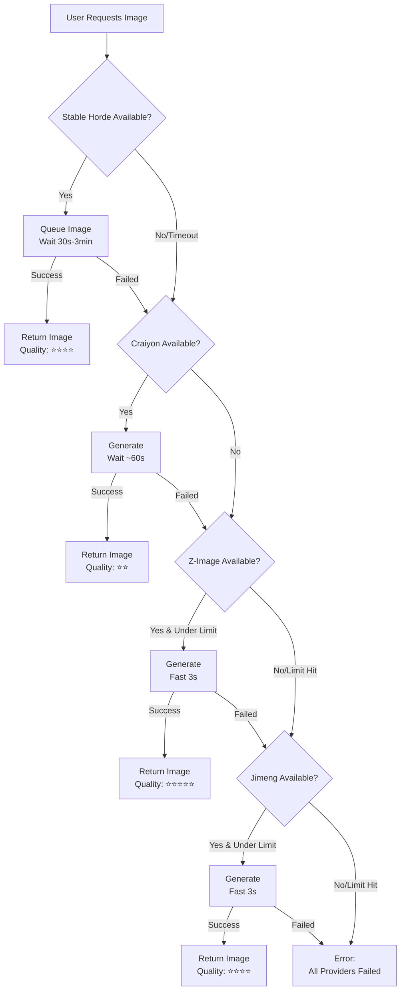

# UNLIMITED-FIRST PROVIDER STRATEGY

## Philosophy: Reliability Over Speed

BLACK AI now prioritizes **unlimited, always-available providers** over fast but rate-limited ones.

**Why?** Better to take 1-3 minutes and always work, than be fast but fail after daily limits.

---

## Provider Priority Order

### **Priority 1: Stable Horde** ⭐ MAIN
- **Type:** Community-powered distributed computing
- **Quality:** ⭐⭐⭐⭐ (Stable Diffusion)
- **Speed:** 30 seconds - 3 minutes (variable queue)
- **Limit:** ✅ **UNLIMITED** (truly, forever)
- **Cost:** FREE (non-profit, volunteers donate GPU)
- **Best for:** Reliable unlimited generation

**Technical Details:**
- 170M+ images generated since 2022
- Anonymous access: API key `0000000000`
- Queue-based (anonymous = lowest priority)
- Non-profit ASBL registered in Luxembourg
- API: https://stablehorde.net/api/v2

**User Experience:**
```
"⏳ Generating your image... (community-powered, may take 1-2 minutes)"
```

---

### **Priority 2: Craiyon** 🔄 FALLBACK 1
- **Type:** Ad-supported free service
- **Quality:** ⭐⭐ (DALL-E Mini, 2022 model)
- **Speed:** ~60 seconds
- **Limit:** ✅ **UNLIMITED**
- **Cost:** FREE (ad-supported)
- **Best for:** Fast unlimited fallback

**Technical Details:**
- Based on DALL-E Mini (old model)
- Resolution: 256x256 base
- Weak on: faces, hands, text, photorealism
- API: https://api.craiyon.com

**User Experience:**
```
"⚡ Using fast backup provider (quality may be lower)"
```

---

### **Priority 3: Z-Image Turbo** 📊 FALLBACK 2
- **Type:** Alibaba ModelScope API
- **Quality:** ⭐⭐⭐⭐⭐ (Best quality)
- **Speed:** 2-5 seconds (fast!)
- **Limit:** ⚠️ **2,000 images/day**
- **Cost:** FREE
- **Best for:** High-quality when unlimited providers fail

**Technical Details:**
- 6 billion parameters
- S3-DiT architecture
- Apache 2.0 license
- Photorealistic, bilingual text rendering

**User Experience:**
```
"✨ High-quality generation available"
```

---

### **Priority 4: Jimeng AI** 📊 FALLBACK 3
- **Type:** ByteDance reverse-engineered API
- **Quality:** ⭐⭐⭐⭐ (Good quality)
- **Speed:** 3-5 seconds
- **Limit:** ⚠️ **80-100 images/day**
- **Cost:** FREE
- **Best for:** Last resort high-quality fallback

**Technical Details:**
- ByteDance/Dreamina platform
- Reverse-engineered API
- Daily credit system
- 2K/4K resolution support

**User Experience:**
```
"🎨 Premium quality generation"
```

---

## Decision Flow



---

## User Experience Scenarios

### **Scenario A: Normal Use (Most Common)**
```
User: "Generate sunset image"
  ↓
Stable Horde: Queue position 15, ~45 seconds
  ↓
User sees: "⏳ Generating... community-powered, please wait"
  ↓
After 45s: ✅ High-quality Stable Diffusion image
```

### **Scenario B: Peak Hours (Stable Horde Overloaded)**
```
User: "Generate sunset image"
  ↓
Stable Horde: Queue position 150, ~5 minutes
  ↓
Timeout after 3 minutes → Try Craiyon
  ↓
Craiyon: ~60 seconds
  ↓
User sees: "⚡ Using fast backup (lower quality)"
  ↓
After 60s: ✅ Lower quality but working image
```

### **Scenario C: All Unlimited Fail (Rare)**
```
User: "Generate sunset image"
  ↓
Stable Horde: Down/Timeout
  ↓
Craiyon: Down
  ↓
Z-Image: ✅ Under 2,000/day limit
  ↓
After 3s: ✅ Best quality image
```

### **Scenario D: Heavy Usage Day**
```
User #2001: "Generate sunset image"
  ↓
Stable Horde: Queue too long
  ↓
Craiyon: API error
  ↓
Z-Image: ❌ Over 2,000/day limit
  ↓
Jimeng: ✅ Still under 100/day
  ↓
After 3s: ✅ Good quality image
```

---

## Benefits of This Strategy

### ✅ **Always Available**
- Unlimited providers mean no "out of quota" errors
- Users can generate as many images as they want
- No frustration from hitting limits

### ✅ **Transparent Expectations**
- Users know it might take 1-2 minutes
- "Community-powered" messaging sets expectation
- Speed is bonus, not requirement

### ✅ **High Quality Options**
- Stable Horde uses Stable Diffusion (good quality)
- Z-Image and Jimeng available for premium quality when needed
- Quality degrades gracefully (Stable Diffusion → DALL-E Mini)

### ✅ **Cost-Effective**
- All providers are free
- No API keys required
- No backend costs
- No user charges

### ✅ **Redundancy**
- 4 providers = high availability
- 2 unlimited + 2 rate-limited
- Multiple failure points before total failure

---

## Monitoring & Metrics

### **Key Metrics to Track:**
1. **Provider Success Rate**
   - % successful generations per provider
   - Time to first success

2. **Queue Times**
   - Average Stable Horde wait time
   - Peak hour vs off-peak

3. **Fallback Frequency**
   - How often we fall through to Craiyon, Z-Image, Jimeng
   - Which provider is used most

4. **User Experience**
   - Average total time to image
   - User satisfaction with wait times
   - Complaints about quality

---

## Future Optimizations

### **Smart Routing (Phase 2)**
```typescript
// Check Stable Horde queue before using
const queueInfo = await stableHorde.checkQueue();
if (queueInfo.estimatedWait > 120) {
  // Skip to Craiyon if queue > 2 minutes
  return craiyon.generate();
}
```

### **Time-Based Routing (Phase 3)**
```typescript
// Use fast providers during peak hours
if (isPeakHours()) {
  priority = [zimage, jimeng, stablehorde, craiyon];
} else {
  priority = [stablehorde, craiyon, zimage, jimeng];
}
```

### **User Preference (Phase 4)**
```typescript
// Let users choose speed vs quality
if (user.preference === 'speed') {
  priority = [zimage, jimeng, stablehorde, craiyon];
} else {
  priority = [stablehorde, craiyon, zimage, jimeng];
}
```

---

## Comparison: Old vs New Strategy

### **OLD (Speed-First):**
```
Jimeng (fast, limited) → Z-Image (fast, limited) → ERROR
❌ Users hit limits after 2,080 images/day
❌ No unlimited fallback
✅ Fast when working (3-5s)
```

### **NEW (Unlimited-First):**
```
Stable Horde (unlimited) → Craiyon (unlimited) → Z-Image (limited) → Jimeng (limited)
✅ Never runs out (truly unlimited)
✅ Always works (4 fallbacks)
⚠️ Slower (30s-3min for unlimited)
✅ Fast fallbacks available (3s when limits not hit)
```

---

## Conclusion

**The unlimited-first strategy prioritizes reliability and accessibility over raw speed.**

For BLACK AI, this aligns with:
- Professional image (always works)
- User trust (no surprise limits)
- Cost control (100% free)
- Scalability (unlimited usage)

Users get:
- ✅ Unlimited generations
- ✅ Always works
- ✅ Good quality (Stable Diffusion)
- ✅ Fast options available
- ✅ Transparent expectations

**Trade-off:** 1-3 minute wait times acceptable for unlimited, reliable service.
