# 9JA AI Platform v1.0 Component Diagrams

## 1. AI Orchestrator
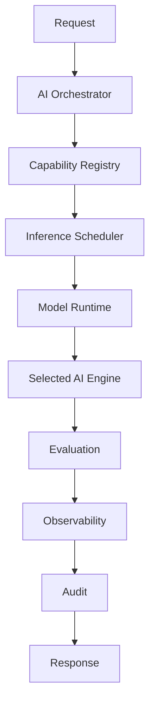

## 2. Knowledge Engine
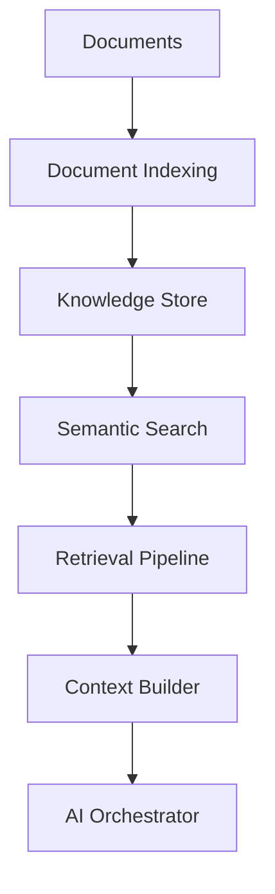

## 3. Memory Engine
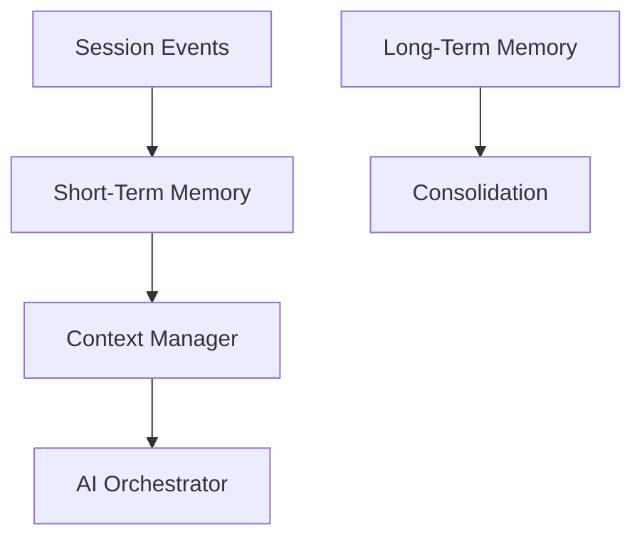

## 4. Capability Registry
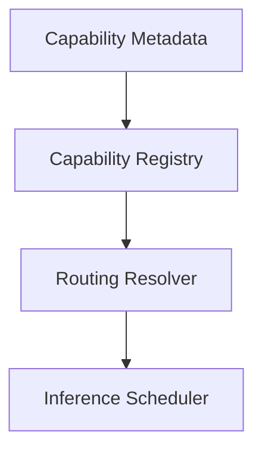

## 5. Inference Scheduler
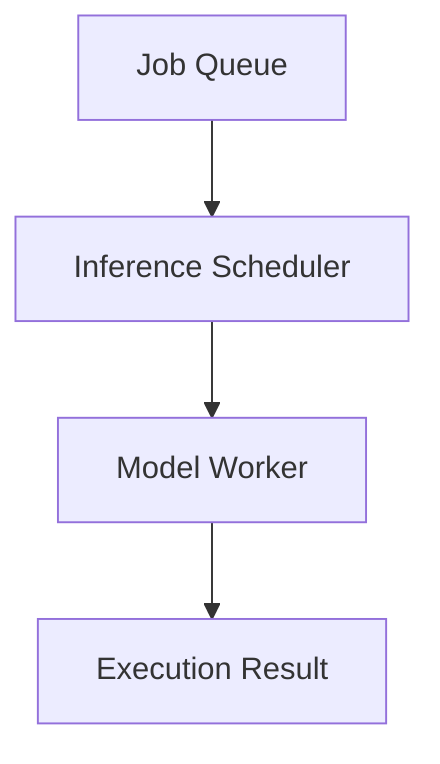

## 6. Model Runtime
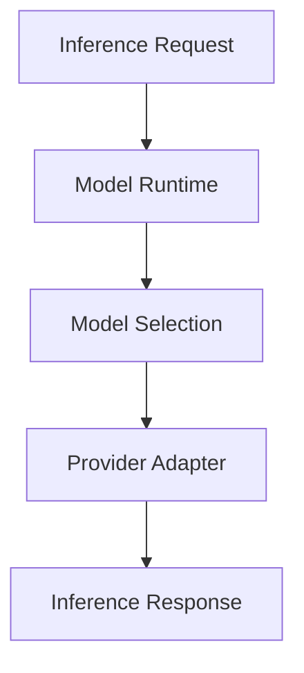

## 7. Language Engine
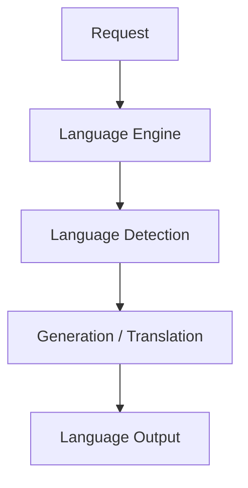

## 8. Vision / OCR / Speech / Image / Video Engines
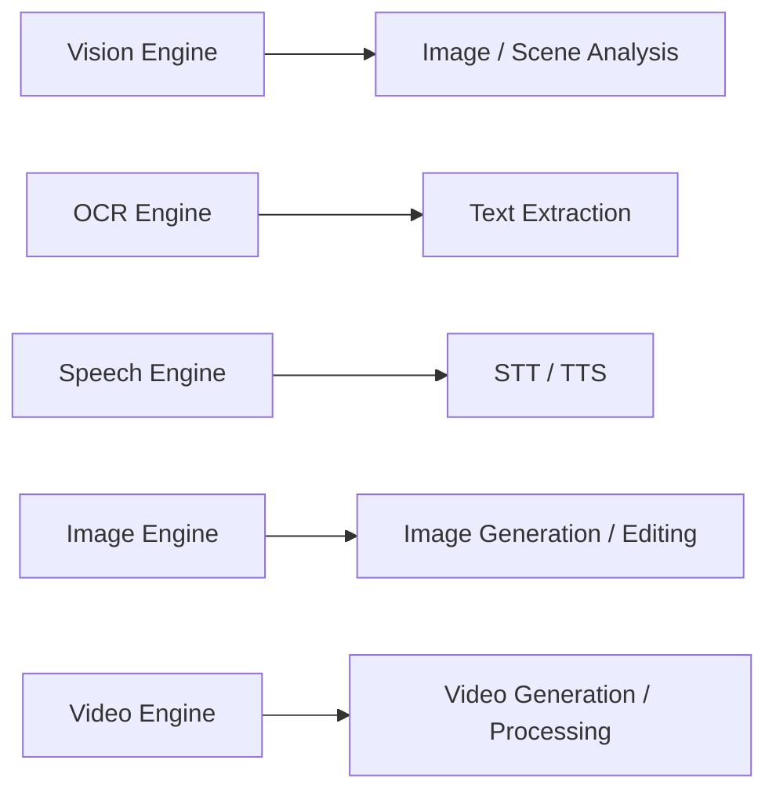

## 9. Nigerian Language Intelligence Engine
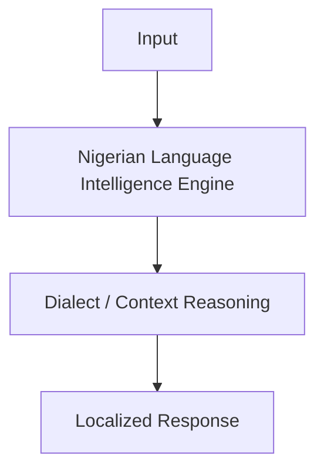

## 10. Autonomous Multi-Agent Engine
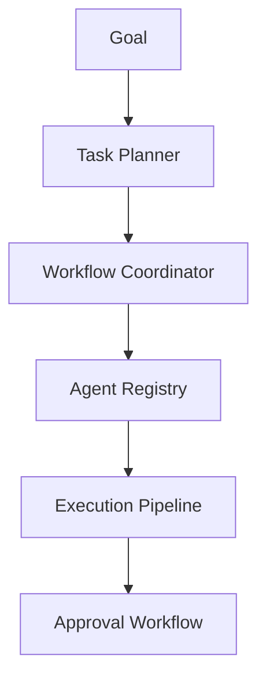

## 11. Evaluation Framework
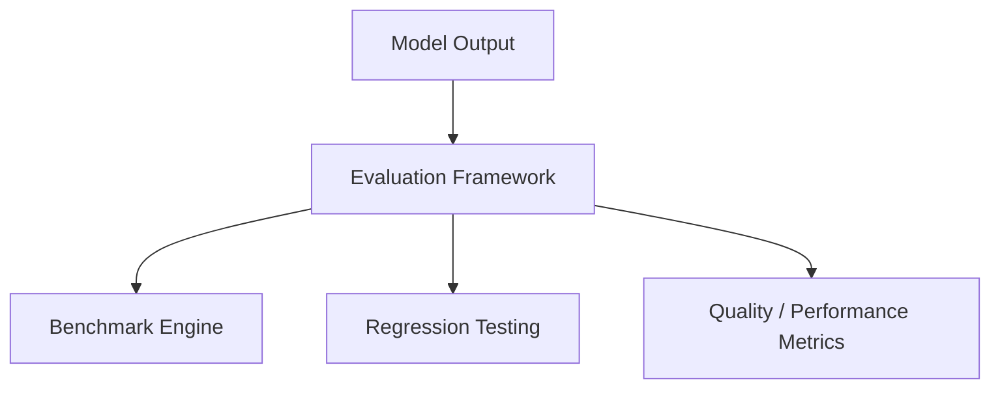

## 12. Universal Connector Platform
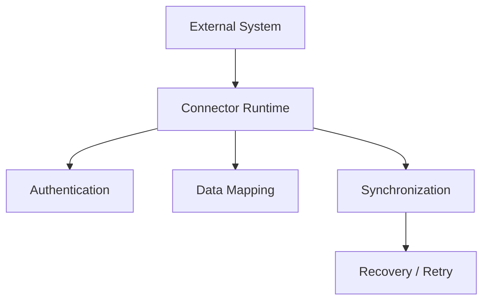

## 13. Developer Platform
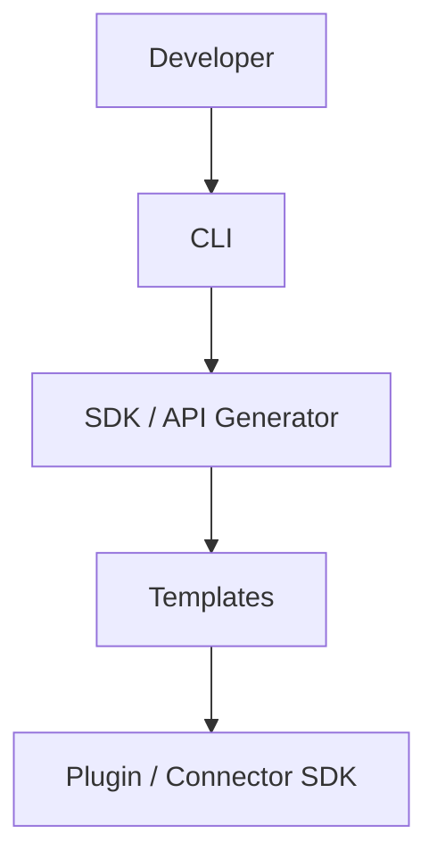

## 14. Security Platform
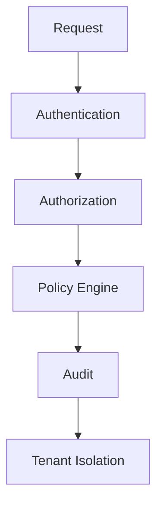

## 15. Distributed Platform
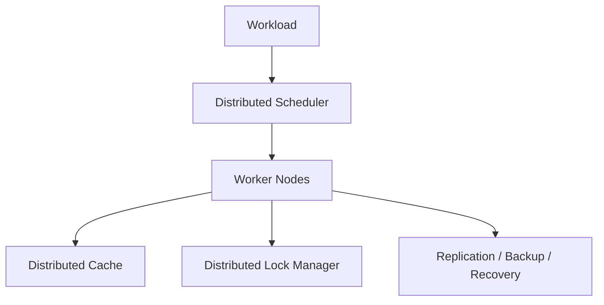

## 16. Performance & Reliability Platform
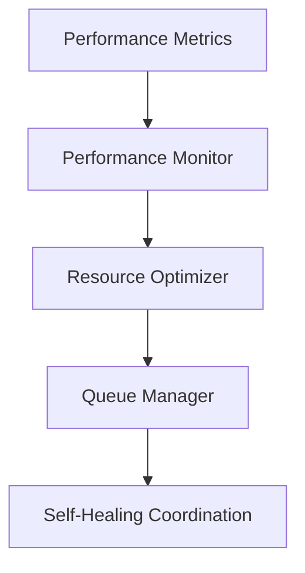

## 17. Developer Console & Operations Center
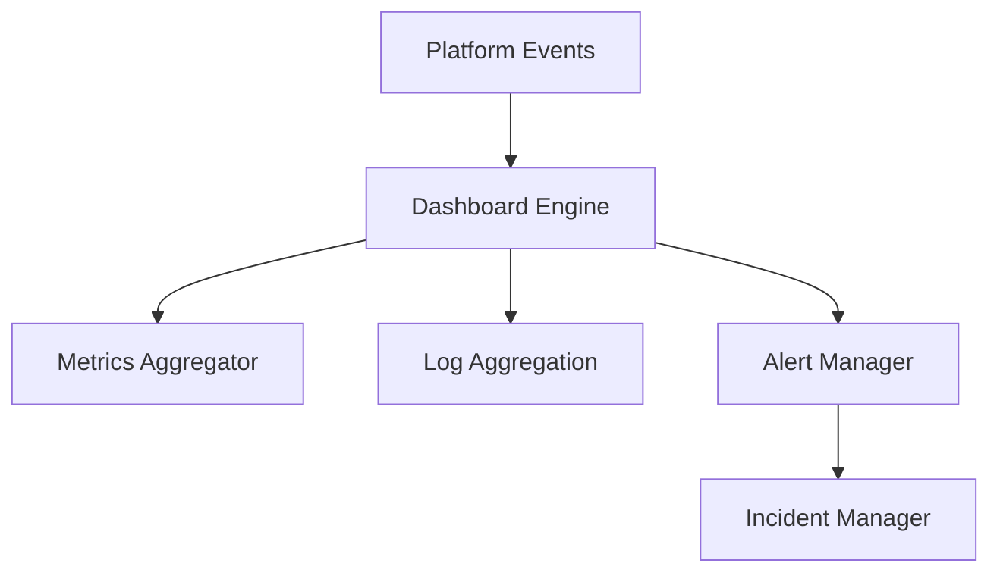
