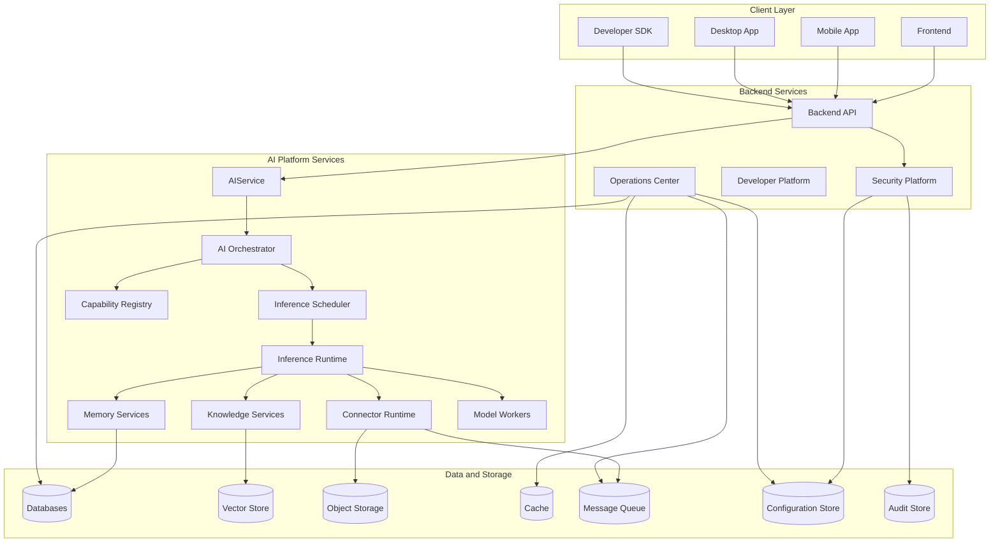

# 9JA AI Platform v1.0 Container Diagram

## C4 Model — Level 2

## Deployable Containers
- Frontend
- Backend API
- AI Platform Services
- Inference Runtime
- Knowledge Services
- Memory Services
- Model Workers
- Connector Runtime
- Security Platform
- Developer Platform
- Operations Center
- Databases and storage services
