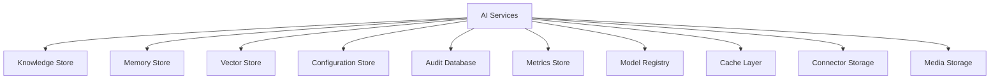

# 9JA AI Platform v1.0 Data Architecture

## Core Data Stores
- Knowledge Store: document and retrieval storage
- Production Knowledge Store: durable indexed knowledge storage
- Memory Store: session and long-term memory records
- Vector Database: embedding and similarity search storage
- Configuration Store: environment and runtime configuration
- Audit Database: governance and audit events
- Metrics Store: observability and performance telemetry
- Model Registry: model metadata and health state
- Cache Layer: high-frequency retrieval and response caching
- Connector Storage: connector credentials and sync state
- Plugin Storage: plugin manifests and extensions
- Media Storage: image, audio, video, and document artifacts

## Relationship Overview

