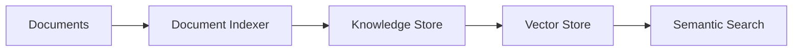
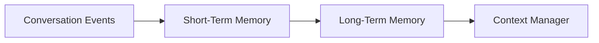
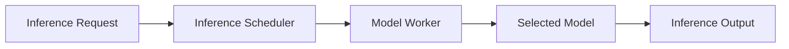
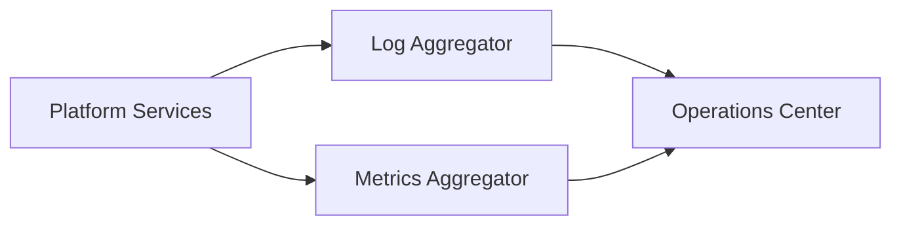
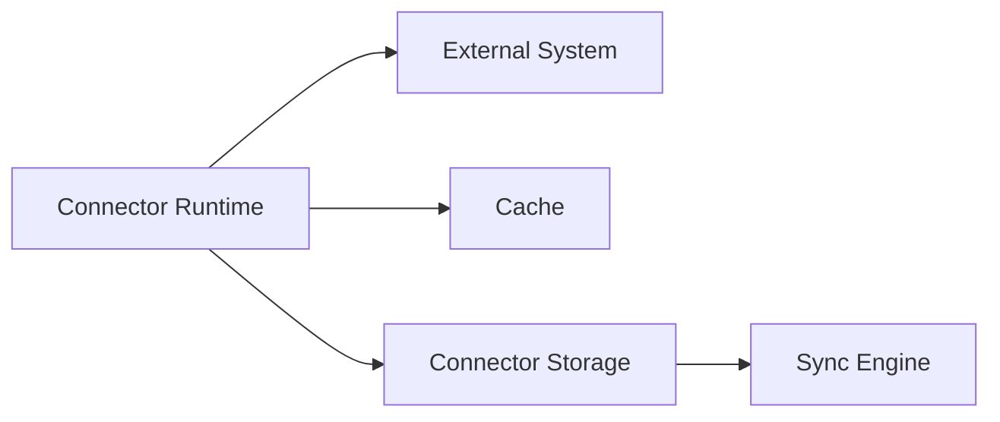

# 9JA AI Platform v1.0 Data Flow Diagrams

## User Requests

```mermaid
flowchart LR
  User[User] --> API[Backend API]
  API --> Auth[Authentication]
  Auth --> Authz[Authorization]
  Authz --> AI[AIService]
  AI --> Orchestrator[AIOrchestrator]
  Orchestrator --> Scheduler[Inference Scheduler]
  Scheduler --> Runtime[Model Runtime]
  Runtime --> Engine[AI Engine]
  Engine --> Eval[Evaluation]
  Eval --> Obs[Observability]
  Obs --> Audit[Audit]
  Audit --> Response[Response]
```

## Knowledge Indexing

```mermaid
flowchart LR
  Docs[Documents] --> Indexer[Document Indexer]
  Indexer --> Store[Knowledge Store]
  Store --> Vector[Vector Store]
  Vector --> Search[Semantic Search]
```

## Memory Updates

```mermaid
flowchart LR
  Events[Conversation Events] --> Short[Short-Term Memory]
  Short --> Long[Long-Term Memory]
  Long --> Context[Context Manager]
```

## Inference Execution

```mermaid
flowchart LR
  Request[Inference Request] --> Scheduler[Inference Scheduler]
  Scheduler --> Worker[Model Worker]
  Worker --> Model[Selected Model]
  Model --> Output[Inference Output]
```

## Logging and Metrics

```mermaid
flowchart LR
  Services[Platform Services] --> Logs[Log Aggregator]
  Services --> Metrics[Metrics Aggregator]
  Logs --> Ops[Operations Center]
  Metrics --> Ops
```

## Connector Synchronization

```mermaid
flowchart LR
  Connector[Connector Runtime] --> Remote[External System]
  Connector --> Cache[Cache]
  Connector --> Store[Connector Storage]
  Store --> Sync[Sync Engine]
```
