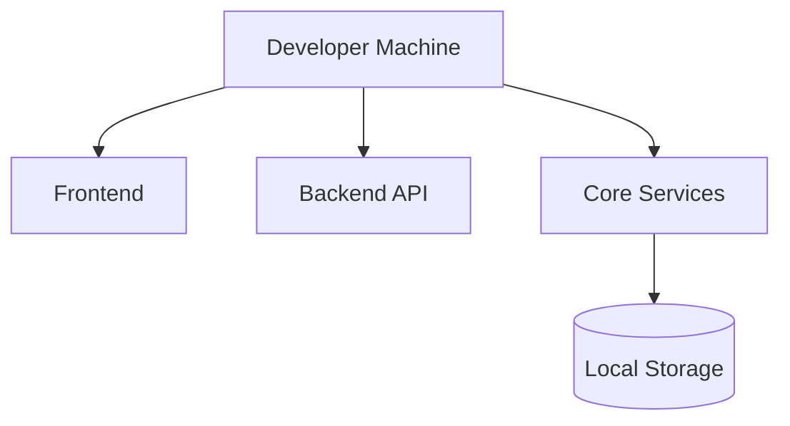
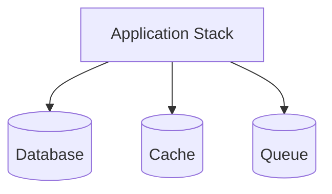
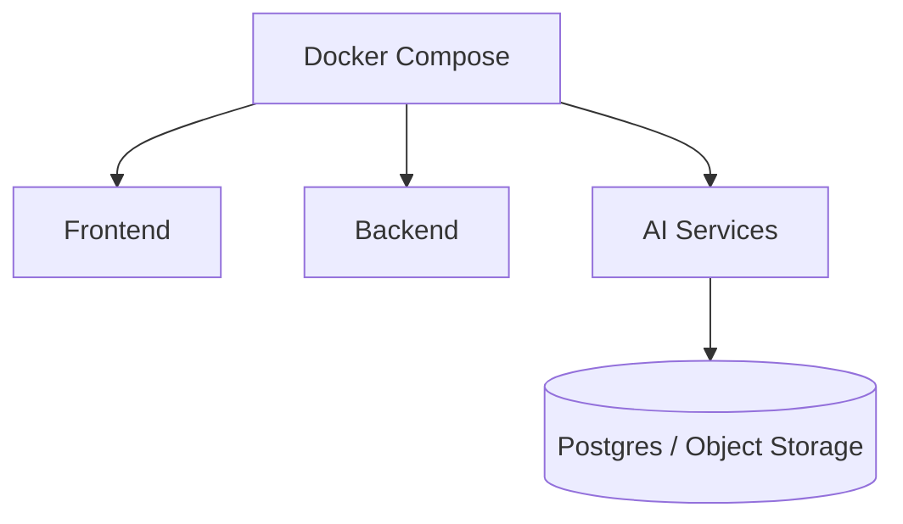
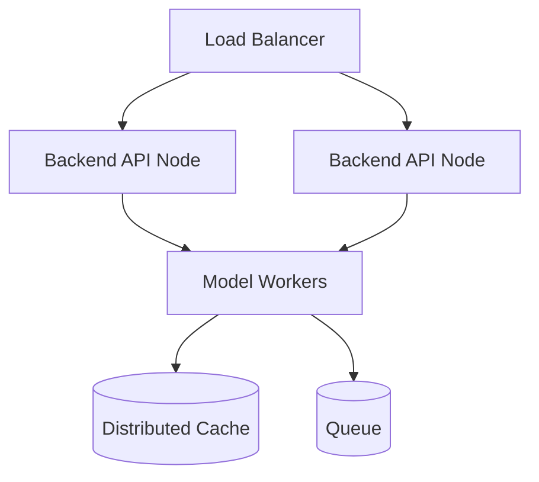
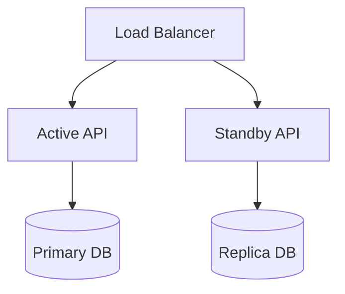
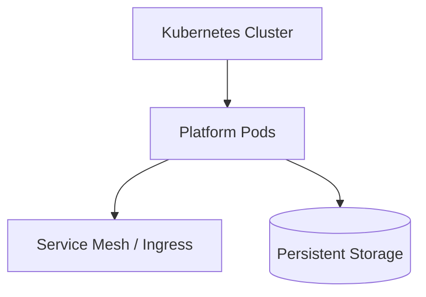
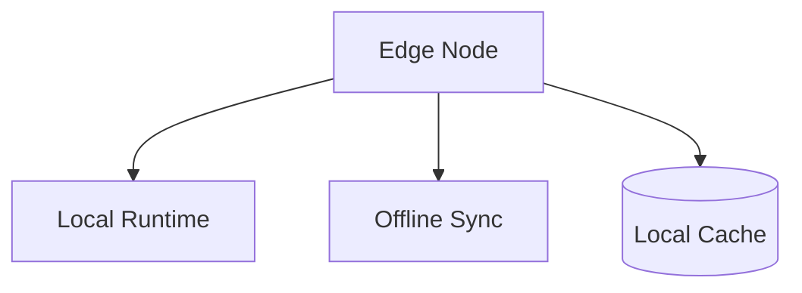

# 9JA AI Platform v1.0 Deployment Architecture

## Local Development

## Single Machine

## Docker Deployment

## Distributed Deployment

## High Availability Deployment

## Future Kubernetes Deployment

## Future Edge Deployment

