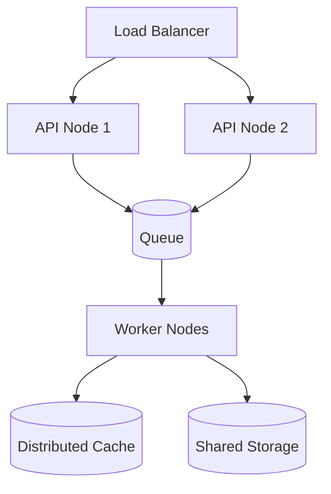

# 9JA AI Platform v1.0 Distributed Architecture

## Distributed Platform Principles
- Horizontal scalability for API and worker nodes
- Shared runtime services and distributed state
- Cache and queue-based decoupling
- Regional service isolation for resilience
- Event-driven coordination between subsystems

## Reference View

## Design Considerations
- Partition workloads between stateless services and stateful workers
- Use async message queues for long-running inference and sync jobs
- Provide health checks and failover for critical services
- Maintain consistency through event logs and reconciliation layers
