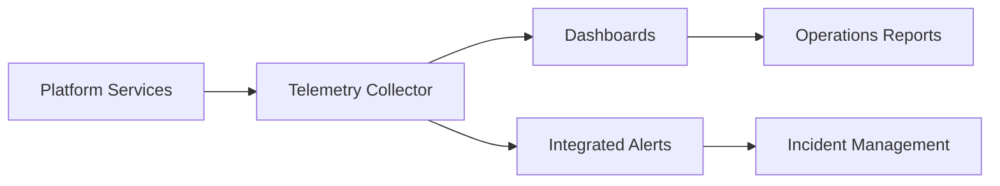

# 9JA AI Platform v1.0 Operations Architecture

## Monitoring Flow

## Operations Responsibilities
- Dashboard and widget framework
- Metrics, logs, traces, and events
- Alert routing and incident tracking
- Release readiness checks
- Search and reporting
- Service health monitoring
