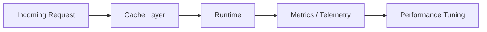

# 9JA AI Platform v1.0 Performance Architecture

## Performance Goals
- Low-latency request handling for conversational experiences
- Efficient model selection and execution routing
- Scalable retrieval for knowledge and memory workflows
- Robust performance under load and partial failure

## Performance Patterns

## Optimization Areas
- Request routing and batching
- Model and provider selection
- Embedding and retrieval optimization
- Caching for repeated requests and context reads
- Observability-based tuning and capacity planning
