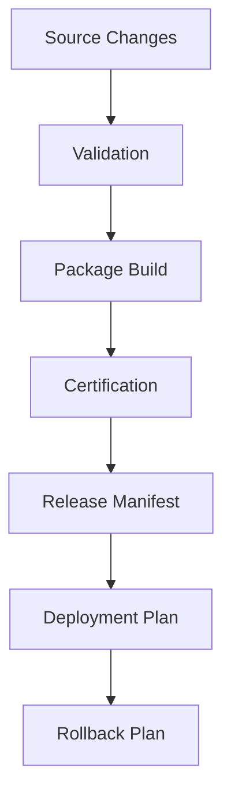

# 9JA AI Platform v1.0 Release Engineering Architecture

## Release Flow

## Release Engineering Capabilities
- Release manifest generation
- Packaging and versioning
- Dependency auditing
- Compatibility checks
- Upgrade and rollback planning
- Validation and certification flow
