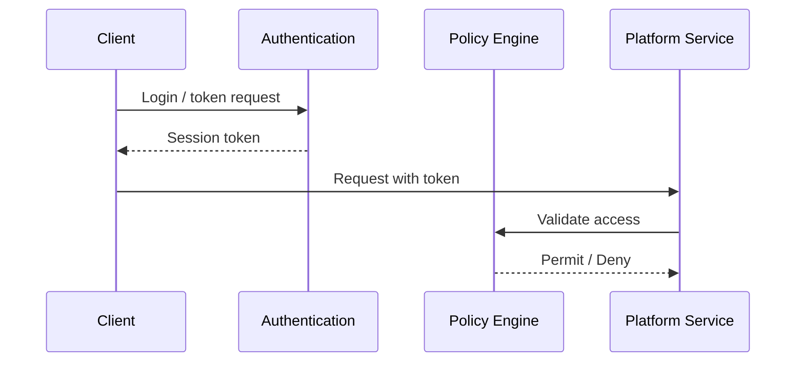

# 9JA AI Platform v1.0 Security Architecture

## Authentication Flow

## Security Architecture Layers
- Authentication
- Authorization
- RBAC and ABAC
- Secrets management
- Encryption and key management
- Audit pipeline
- Trust framework
- Tenant isolation
- Security event flow
