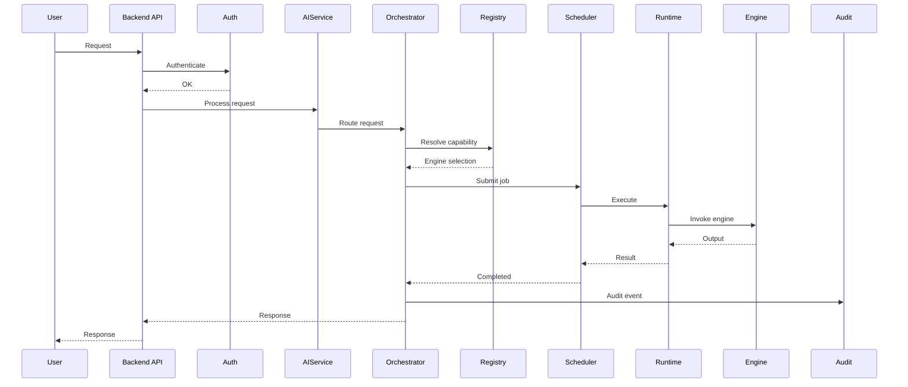
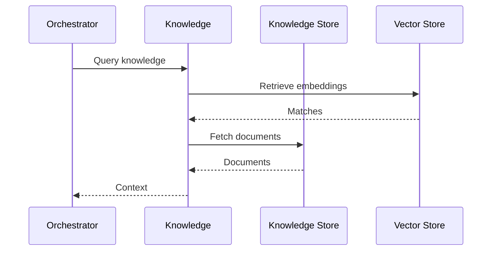
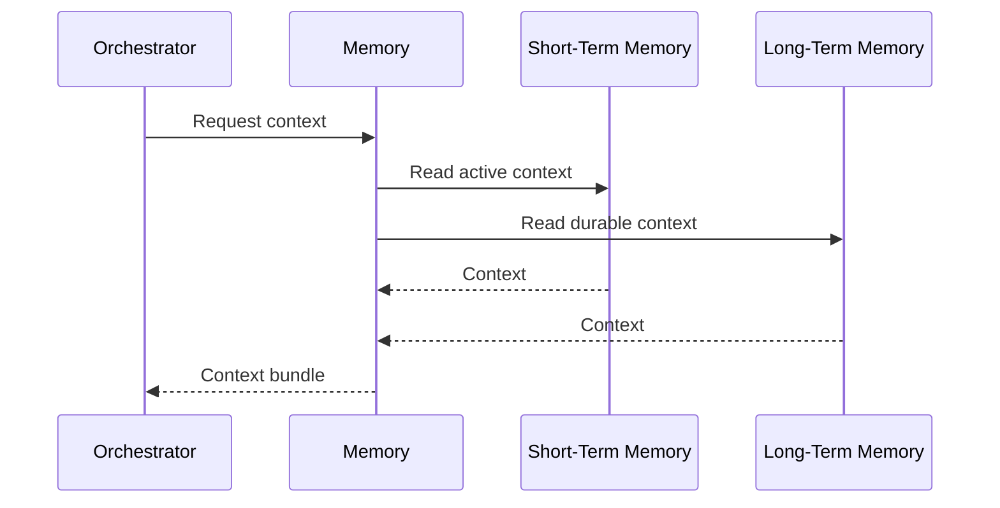
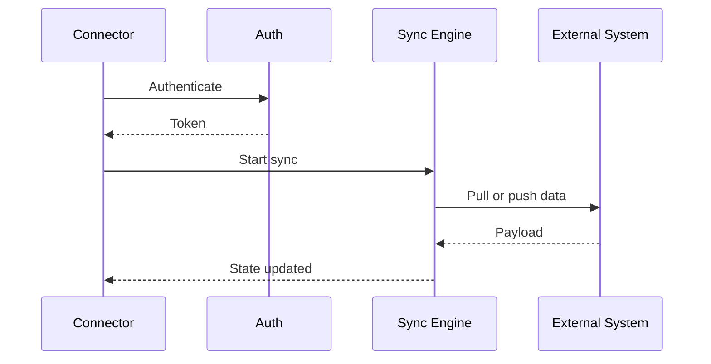
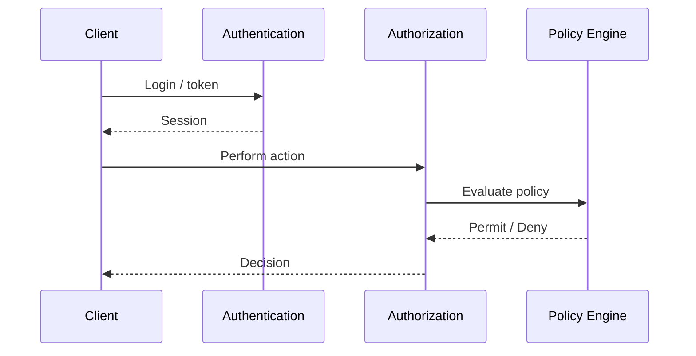
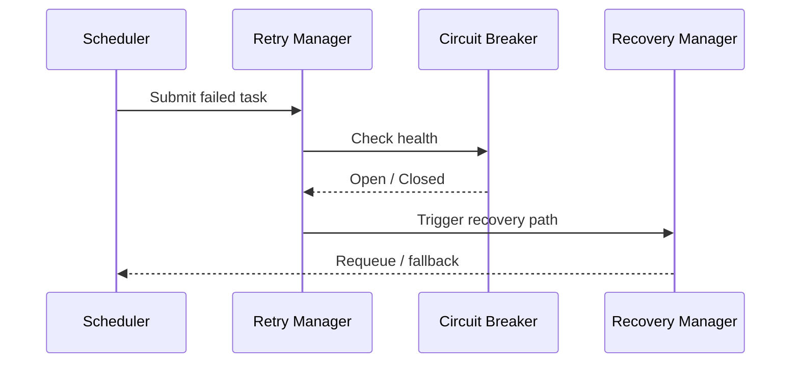

# 9JA AI Platform v1.0 Sequence Diagrams

## Standard Chat Request

## Knowledge Retrieval

## Memory Retrieval

## Connector Synchronization

## Authentication and Authorization

## Failure Recovery

