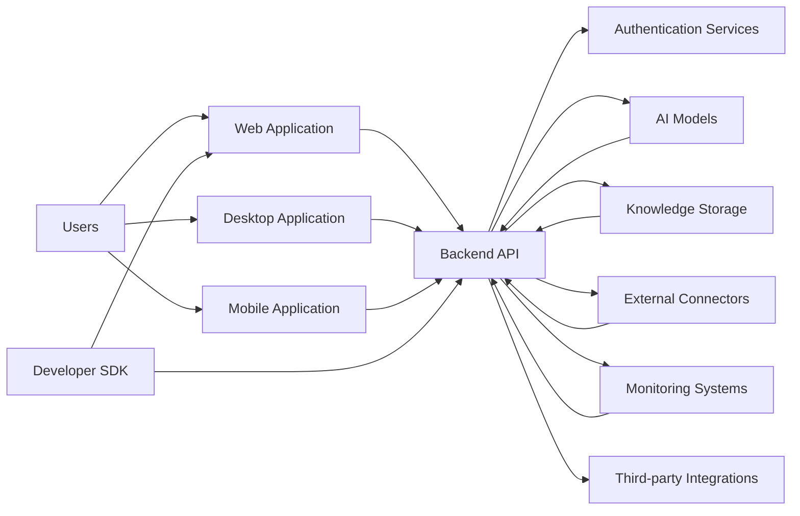

# 9JA AI Platform v1.0 System Context Diagram

## C4 Model — Level 1

## System Boundaries
- Internal platform boundary: 9JA AI Platform services and runtime
- External systems: users, SDKs, AI models, authentication services, monitoring systems, third-party connectors

## Primary Actors
- End users
- Developers
- Platform operators
- Integrators
