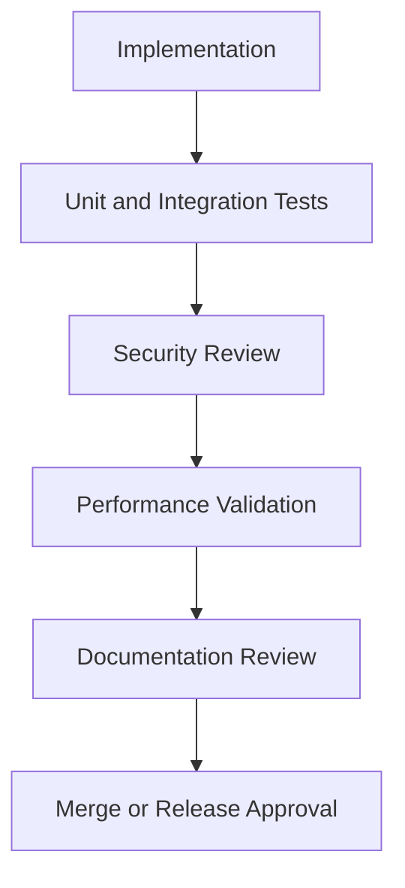

# 9JA AI Technical Standards Manual
### Version 1.0

> This manual is the official implementation standard for the 9JA AI Platform. It defines how the platform must be built, tested, secured, operated, documented, and released. It is not a replacement for the architecture reference, engineering handbook, product specification, implementation roadmap, or ADRs. Instead, it provides the mandatory engineering rules that make those documents real in code and operations.

---

## Table of Contents

1. [Introduction](#1-introduction)
2. [Engineering Principles](#2-engineering-principles)
3. [Coding Standards](#3-coding-standards)
4. [Project Structure Standards](#4-project-structure-standards)
5. [API Standards](#5-api-standards)
6. [Database Standards](#6-database-standards)
7. [AI Model Standards](#7-ai-model-standards)
8. [AI Prompt Standards](#8-ai-prompt-standards)
9. [Knowledge and Memory Standards](#9-knowledge-and-memory-standards)
10. [Vision Standards](#10-vision-standards)
11. [OCR Standards](#11-ocr-standards)
12. [Speech Standards](#12-speech-standards)
13. [Image Generation Standards](#13-image-generation-standards)
14. [Video Standards](#14-video-standards)
15. [Plugin Standards](#15-plugin-standards)
16. [Connector Standards](#16-connector-standards)
17. [UI/UX Standards](#17-uiux-standards)
18. [Security Standards](#18-security-standards)
19. [Testing Standards](#19-testing-standards)
20. [Performance Standards](#20-performance-standards)
21. [Observability Standards](#21-observability-standards)
22. [DevOps Standards](#22-devops-standards)
23. [Documentation Standards](#23-documentation-standards)
24. [Code Review Standards](#24-code-review-standards)
25. [Release Standards](#25-release-standards)
26. [Quality Gates](#26-quality-gates)
27. [Compliance Matrix](#27-compliance-matrix)
28. [Future Evolution](#28-future-evolution)
29. [Glossary](#29-glossary)
30. [References](#30-references)

---

## 1. Introduction

### Purpose
This manual establishes the mandatory engineering standards, implementation conventions, coding practices, API standards, security requirements, testing expectations, AI integration standards, UI standards, operational practices, and release requirements used throughout the 9JA AI platform.

### Audience
This manual applies to:
- software engineers,
- AI engineers,
- platform engineers,
- security engineers,
- DevOps engineers,
- QA engineers,
- UI/UX engineers,
- technical writers,
- contractors,
- future maintainers of the platform.

### Scope
This manual covers all implementation work for Version 1.0 across:
- platform services,
- AI engines,
- APIs and SDKs,
- UI surfaces,
- mobile and desktop applications,
- plugins and connectors,
- release engineering,
- security and compliance controls.

### Guiding Principles
The standards in this manual are based on the following principles:
- build for clarity before optimization,
- make correctness and security the default,
- prefer explicit contracts over implicit assumptions,
- keep modules small, focused, and replaceable,
- make every system observable and testable,
- preserve backward compatibility unless a versioned migration path exists.

### Relationship to the Architecture
The architecture defines what the platform is and how its major systems interact. This manual defines how those systems must be implemented and governed.

### Relationship to the Engineering Handbook
The engineering handbook is the contributor-facing operating standard. This manual is the implementation contract used by engineers while writing code and designing systems.

### Relationship to the Product Specification
The product specification defines capabilities and user outcomes. This manual defines the engineering methods and policies required to deliver those capabilities reliably.

### Relationship to ADRs
Architecture Decision Records capture rationale for major architectural decisions. This manual defines the implementation expectations that must be preserved when those decisions are applied in code.

### Normative Language
The words MUST, SHOULD, and MAY are used as follows:
- MUST: mandatory requirement
- SHOULD: recommended best practice unless a valid exception is documented
- MAY: optional implementation choice

---

## 2. Engineering Principles

### 2.1 Simplicity
Prefer clear, direct solutions over clever abstractions. Simplicity reduces maintenance cost and lowers the chance of defects.

### 2.2 Maintainability
Write code that another engineer can understand, extend, and support six months from now.

### 2.3 Testability
Every significant module MUST be designed so it can be tested in isolation and in integration.

### 2.4 Extensibility
Core services MUST be extensible through stable interfaces, registries, dependency injection, plugin hooks, or connectors.

### 2.5 Security by Default
Security controls MUST be part of the design from day one. Do not defer hardening until later phases.

### 2.6 Privacy by Design
PINs, credentials, secrets, personal data, and sensitive content MUST be handled according to least-privilege and data-minimization rules.

### 2.7 Observability First
Every critical workflow MUST expose enough telemetry to diagnose failures without guesswork.

### 2.8 Modular Architecture
Modules MUST have a single responsibility and minimal coupling to unrelated concerns.

### 2.9 Dependency Inversion
High-level services MUST depend on abstractions rather than concrete implementations where appropriate.

### 2.10 SOLID Principles
Implementation work SHOULD follow SOLID design principles, especially:
- Single Responsibility Principle
- Open/Closed Principle
- Liskov Substitution Principle
- Interface Segregation Principle
- Dependency Inversion Principle

### 2.11 Clean Architecture
Domain logic SHOULD remain independent of frameworks, UI concerns, and transport layers where feasible.

### 2.12 Domain-Driven Design
Core business concepts, language features, and workflow semantics SHOULD be modeled explicitly in domain modules.

### 2.13 Separation of Concerns
Cross-cutting concerns such as logging, security, telemetry, auth, validation, and retries MUST be handled through shared infrastructure rather than embedded inside feature code.

---

## 3. Coding Standards

### 3.1 TypeScript
All new platform code MUST be written in TypeScript unless a specific exception is documented.

Required rules:
- use strict mode,
- avoid `any` unless unavoidable and justified,
- prefer explicit interfaces and discriminated unions,
- use `unknown` instead of `any` when a type is not yet known,
- enable and preserve compiler safety checks.

Example:
```ts
export interface ChatRequest {
  tenantId: string;
  input: string;
  locale: string;
}

export async function handleChat(req: ChatRequest): Promise<string> {
  return req.input;
}
```

### 3.2 JavaScript
JavaScript MAY be used only when required for legacy compatibility or thin integration wrappers. New business logic MUST not be written in JavaScript if TypeScript is available.

### 3.3 Folder Structure
Source files MUST be organized to reflect domain boundaries and architectural layers.

### 3.4 Naming Conventions
- Classes and types: PascalCase
- Functions and variables: camelCase
- Constants and env keys: UPPER_SNAKE_CASE
- Files: kebab-case or domain-based naming, consistent within a module
- Boolean names: use `is`, `has`, `can`, or `should`

### 3.5 Classes
Classes SHOULD be used for stateful abstractions or framework integration points. They MUST NOT be used as a substitute for simple functions when a function is clearer.

### 3.6 Interfaces
Interfaces MUST define stable contracts for public APIs, engine boundaries, plugin contracts, and connector adapters.

### 3.7 Enums
Enums SHOULD be used sparingly and only for closed sets of values. String-based enums are preferred over numeric enums.

### 3.8 Functions
Functions SHOULD be small, focused, and deterministic. A function SHOULD be no longer than 40 lines unless a clear exception is documented.

### 3.9 Constants
Constants MUST be named clearly and centralized where shared. Environment-specific values MUST be provided through configuration, not hard-coded.

### 3.10 Files
Each file SHOULD contain one primary responsibility. Files SHOULD not become dumping grounds for unrelated logic.

### 3.11 Modules
Modules MUST expose intentional, documented interfaces. Internal implementation details SHOULD remain private unless shared explicitly.

### 3.12 Dependency Injection
Dependencies SHOULD be injected rather than created internally inside business logic. This improves testability and composability.

### 3.13 Async/Await and Promises
Use `async/await` for asynchronous control flow. Avoid callback-heavy patterns. Always handle rejection paths explicitly.

### 3.14 Generics
Use generics where they improve reusability and type safety, especially for collections, adapters, and service abstractions.

### 3.15 Error Handling
Errors MUST be typed, contextual, and actionable. Avoid swallowing errors silently.

Recommended pattern:
```ts
try {
  await doWork();
} catch (error) {
  logger.error({ err: error }, 'work failed');
  throw new Error('Work failed');
}
```

### 3.16 Logging
Use structured logging and log only appropriate levels. Do not log secrets, tokens, credentials, or raw PII.

### 3.17 Comments
Comments SHOULD explain intent, trade-offs, and non-obvious decisions. Do not comment obvious code.

### 3.18 Documentation
Public functions, services, engines, APIs, plugins, and connectors MUST have documentation or inline examples where relevant.

### 3.19 Formatting
Formatting MUST be consistent. Prettier and ESLint MUST be used for style enforcement.

### 3.20 Linting
All code MUST pass linting and type-checking before merge.

### 3.21 Prettier
Use Prettier defaults unless the repository defines a specific style guide. Keep diffs focused and readable.

### 3.22 ESLint
ESLint rules MUST enforce:
- no unused variables,
- no unsafe casts,
- no console logging in production code,
- no unreachable code,
- no shadowed variables.

### 3.23 Code Organization
Code MUST be organized into reusable modules, not monolithic files. Shared logic SHOULD live in shared or core packages.

### 3.24 Reusable Utilities
Utility code MUST be generalized, tested, and documented. Avoid one-off helpers scattered across feature modules.

### 3.25 File Size Guidance
- Keep normal modules under 250 lines where feasible.
- Keep complex modules under 400 lines.
- Split modules that exceed this size.

### 3.26 Function Size Guidance
- Prefer functions under 40 lines.
- Split any function above 60 lines.

### 3.27 Cyclomatic Complexity Guidance
- Target a complexity score below 10 per function.
- Refactor functions that exceed 15.

---

## 4. Project Structure Standards

The repository MUST follow a layered structure that separates platform concerns from product surfaces.

### 4.1 Top-Level Structure
- `src/` — entry points, app integration, and product-specific wiring
- `core/` — shared platform abstractions, contracts, utilities, and infrastructure services
- `engines/` — AI capability engines such as language, vision, OCR, speech, knowledge, memory, and image/video
- `runtime/` — runtime lifecycle, orchestration, execution context, and core execution services
- `scheduler/` — request scheduling, batching, queues, retries, and inference coordination
- `memory/` — short- and long-term memory abstractions and persistence hooks
- `knowledge/` — knowledge ingestion, retrieval, ranking, embeddings, and document indexing
- `providers/` — model providers, adapters, connectors, external vendor integrations
- `services/` — domain services and application workflows
- `api/` — API routes, request handlers, OpenAPI definitions, and versioned entry points
- `ui/` — shared web UI components and frontend composition layers
- `mobile/` — Android-specific implementation and mobile platform integrations
- `desktop/` — desktop application implementation and shell integrations
- `shared/` — cross-platform shared code and models
- `plugins/` — plugin framework, manifests, and plugin runtime integration
- `connectors/` — connector implementations, auth flows, and sync logic
- `tests/` — unit, integration, e2e, performance, and evaluation tests
- `docs/` — product, architecture, engineering, standards, release, and operations documents
- `scripts/` — automation, build, release, migration, and maintenance scripts
- `config/` — runtime and environment configuration templates and defaults
- `assets/` — static assets, icons, images, fonts, and non-code resources

### 4.2 Folder Responsibilities
- `core/` MUST contain reusable abstractions for runtime, configuration, security, telemetry, and shared services.
- `engines/` MUST contain capability implementations and their public contracts.
- `api/` MUST contain versioned handlers and API schemas.
- `ui/`, `mobile/`, and `desktop/` MUST contain experience-specific implementations only.
- `tests/` MUST contain the corresponding test suites for the implementation modules.
- `providers/` MUST not contain product-specific business logic; it MUST contain adaptation layers and provider-specific integration points.
- `plugins/` and `connectors/` MUST remain isolated and must use shared contracts.

### 4.3 Import Rules
- application layers MAY depend on platform services,
- platform services MUST NOT depend on UI-specific implementations,
- shared modules MUST NOT import from feature-specific modules unless explicitly necessary.

---

## 5. API Standards

### 5.1 REST Principles
APIs MUST follow RESTful resource-oriented design and use standard HTTP semantics.

### 5.2 Endpoint Naming
- use lowercase paths,
- use plural nouns for collections,
- use resource IDs in path segments,
- use verbs only when necessary and avoid RPC-style URLs.

Recommended patterns:
- `GET /v1/knowledge/documents`
- `POST /v1/chat/messages`
- `GET /v1/models`

### 5.3 Versioning
All public APIs MUST be versioned. Versioning MUST be explicit in the URL path, such as `/v1/`.

### 5.4 Request Models
Request payloads MUST be validated and strongly typed. Required fields MUST be explicit.

### 5.5 Response Models
Responses MUST follow a predictable structure with clear success and failure envelopes.

### 5.6 Status Codes
Use standard HTTP status codes:
- `200` success
- `201` created
- `202` accepted
- `204` no content
- `400` invalid request
- `401` authentication required
- `403` forbidden
- `404` not found
- `409` conflict
- `422` validation failed
- `429` rate limit exceeded
- `500` server error

### 5.7 Pagination
Pagination MUST support:
- page size,
- page number or cursor,
- total count when feasible.

### 5.8 Sorting and Filtering
Sorting and filtering MUST be explicit, documented, and validated.

### 5.9 Authentication and Authorization
- authentication MUST be enforced for protected endpoints,
- authorization MUST be based on roles or attributes,
- tokens MUST be validated and scoped.

### 5.10 Error Responses
Error payloads MUST include:
- error code,
- message,
- request correlation ID,
- optional field-level details.

### 5.11 Rate Limiting
APIs MUST support rate limiting and backoff behavior. Limit headers SHOULD be exposed.

### 5.12 OpenAPI and Swagger
All public APIs MUST be documented with OpenAPI-compliant schemas. Swagger or equivalent tooling MUST be used for generated documentation.

### 5.13 JSON Standards
- use UTF-8,
- use camelCase for field names,
- avoid ambiguous null semantics,
- prefer consistent date-time formats.

### 5.14 Request Validation
Request validation MUST occur at the boundary and MUST reject invalid or malformed payloads early.

### 5.15 Response Validation
Responses SHOULD be validated against declared schemas to prevent contract drift.

### 5.16 Idempotency
State-changing operations SHOULD support idempotency keys or equivalent replay protections for retries.

---

## 6. Database Standards

### 6.1 IDs
All records MUST use stable, globally unique identifiers. UUIDs SHOULD be preferred for distributed systems.

### 6.2 Timestamps
Every persisted entity MUST include `createdAt` and `updatedAt` timestamps.

### 6.3 Soft Delete
Soft deletion SHOULD be used for business records unless a hard-delete requirement is explicitly documented.

### 6.4 Indexes
Indexes MUST be added for frequently filtered, sorted, or joined fields. Index changes MUST be reviewed for performance implications.

### 6.5 Foreign Keys
Foreign key relationships SHOULD be enforced where the database engine supports them, unless the system intentionally uses denormalized patterns.

### 6.6 Migration Strategy
Schema changes MUST be applied through versioned migrations. Rollback plans MUST be documented.

### 6.7 Schema Evolution
Breaking changes MUST be versioned and deployed in a backward-compatible way where possible.

### 6.8 Backups
Databases MUST have backup and recovery procedures aligned to the release and operations standards.

### 6.9 Audit Logs
Sensitive or administrative operations MUST produce audit events with actor, timestamp, affected resource, and outcome.

### 6.10 Versioning
Schema versioning MUST be explicit in migration metadata and deployment documentation.

### 6.11 Naming Conventions
Database objects SHOULD use lowercase, snake_case names. Collections and tables MUST be named consistently and descriptively.

---

## 7. AI Model Standards

### 7.1 Model Registry
Every supported model MUST be registered with metadata including provider, capability, version, pricing, latency budget, region, and evaluation status.

### 7.2 Provider Registry
Providers MUST be registered through a shared provider abstraction so routing, retries, and fallback logic remain consistent.

### 7.3 Capability Registry
Capabilities MUST be mapped to models so the runtime can select the correct model for each operation.

### 7.4 Model Runtime
The model runtime MUST expose a stable interface for invocation, timeout handling, retry handling, and result transformation.

### 7.5 Inference Scheduler
Inference scheduling MUST support queueing, prioritization, cancellation, and retry policies.

### 7.6 Provider Adapters
Each provider integration MUST be isolated behind an adapter layer with consistent error handling and metadata propagation.

### 7.7 Prompt Routing
Prompt routing MUST be determined by capability, policy, and context rather than by hard-coded ad hoc branches.

### 7.8 Context Management
Context windows, conversation history, and memory injection MUST be controlled and documented to avoid unstable or overly expensive prompts.

### 7.9 Fallback Strategy
Model invocation MUST support fallback to alternate providers or models when the primary path fails or exceeds latency targets.

### 7.10 Model Metadata
Model metadata MUST include:
- name,
- version,
- provider,
- capability,
- context window,
- latency budget,
- pricing,
- safety category,
- availability state.

### 7.11 Pricing and Latency Metadata
Pricing and latency MUST be tracked so routing and cost controls remain measurable.

### 7.12 Evaluation Metadata
Every model MUST carry evaluation outcomes, including benchmark scores, quality notes, and known limitations.

### 7.13 Capability Scoring
Capabilities MUST be scored and compared using a consistent rubric before being promoted into production routing.

### 7.14 Model Health
Model health status MUST be surfaced through the observability and runtime systems.

### 7.15 Model Lifecycle
Models MUST go through explicit lifecycle stages: experimental, beta, production, deprecated, retired.

### 7.16 Versioning and Retirement
Model versions MUST be versioned. Retired models MUST remain available for a documented transition period or be removed in a controlled release.

---

## 8. AI Prompt Standards

### 8.1 Prompt Templates
Prompt templates MUST be versioned and stored centrally. They MUST avoid hard-coded secrets or unsafe assumptions.

### 8.2 System Prompts
System prompts MUST be concise, explicit, and aligned with platform safety and policy requirements.

### 8.3 Context Windows
Prompt length and context window usage MUST be monitored. Excessive context MUST be trimmed or summarized.

### 8.4 Memory Injection
Long-term and short-term memory injection MUST be explicit and auditable. Memory access SHOULD be traceable to the originating context.

### 8.5 Safety Prompts
Safety prompts MUST be applied when required by the capability and policy boundaries.

### 8.6 Prompt Variables
Prompt variables MUST be type-safe, validated, and escaped where needed.

### 8.7 Prompt Versioning
Every prompt template MUST have a version and change history.

### 8.8 Prompt Testing
Prompts MUST be tested for quality, safety, deterministic behavior, and regression effects.

### 8.9 Prompt Optimization
Prompt optimization SHOULD be done through measurable evaluation rather than anecdotal tuning.

### 8.10 Prompt Caching
Reusable prompt components MAY be cached where safe and deterministic.

### 8.11 Few-Shot Examples
Few-shot examples MUST be reviewed for quality, bias, and relevance. They SHOULD be limited and tested.

### 8.12 Chain-of-Thought Handling
Chain-of-thought reasoning SHOULD NOT be exposed in production prompts unless explicitly required and reviewed. Reasoning boundaries MUST be enforced.

### 8.13 Reasoning Boundaries
Model behavior MUST be constrained to approved domains and policies. Sensitive reasoning MUST be routed through approved safety and evaluation layers.

---

## 9. Knowledge and Memory Standards

### 9.1 Knowledge Ingestion
Knowledge content MUST be ingested through validated pipelines with source metadata and provenance information.

### 9.2 Document Indexing
Documents MUST be chunked, normalized, and indexed consistently before retrieval.

### 9.3 Chunking
Chunk size and overlap MUST be configured for quality and performance. Chunking strategy SHOULD be versioned.

### 9.4 Embeddings
Embeddings MUST be generated through approved pipelines with explicit model and version metadata.

### 9.5 Semantic Search
Semantic search MUST be tested for relevance and should include fallback strategies for low-confidence results.

### 9.6 Retrieval
Retrieval results MUST be ranked and filtered according to policy, scope, and quality requirements.

### 9.7 Ranking
Ranking logic MUST be deterministic and explainable where possible.

### 9.8 Memory Lifecycle
Memory entries MUST have a lifecycle governing creation, expiration, updates, and deletion.

### 9.9 Long-Term and Short-Term Memory
Long-term memory MUST be separated from short-term context to prevent inappropriate persistence or leakage.

### 9.10 Context Assembly
Context assembly MUST combine retrieved knowledge, memory, and user requests in a controlled and auditable way.

### 9.11 Knowledge Expiration
Outdated or invalid knowledge MUST expire or be invalidated using documented rules.

### 9.12 Caching
Knowledge and memory retrieval layers MUST use caching where appropriate, but cached data MUST not bypass safety or privacy controls.

---

## 10. Vision Standards

### 10.1 Image Analysis
Image analysis workflows MUST be versioned and tested for accuracy and latency.

### 10.2 Object Detection
Object detection features MUST define confidence thresholds and fallback behavior.

### 10.3 OCR Integration
Vision pipelines MUST support OCR and structured extraction where relevant.

### 10.4 Visual Reasoning
Visual reasoning workflows MUST be constrained to approved domains and provide clear failure states.

### 10.5 Image Preprocessing
Images MUST be normalized and sanitized before analysis. Unsupported formats MUST fail clearly.

### 10.6 Image Normalization
Image resizing, color normalization, and orientation handling MUST be standardized.

### 10.7 Vision Providers
Vision providers MUST be isolated via adapters and evaluated consistently.

### 10.8 Vision Evaluation
Vision capabilities MUST be tested against representative datasets and quality benchmarks.

---

## 11. OCR Standards

### 11.1 Document Parsing
Document parsing MUST preserve structure where possible, including headings, tables, and sections.

### 11.2 Table Extraction
Table extraction MUST maintain row and column semantics and be validated with representative documents.

### 11.3 Handwriting Support
Handwriting extraction MUST be treated as a specialized capability and not assumed to be universally reliable.

### 11.4 Confidence Scoring
OCR output MUST include confidence scores and validation metadata where supported.

### 11.5 Language Detection
Language detection MUST be supported where multilingual documents are expected.

### 11.6 Layout Analysis
Layout analysis SHOULD be used to preserve hierarchy and semantics.

### 11.7 PDF Handling
PDF ingestion MUST support page-level processing, metadata preservation, and clear failure states.

### 11.8 Image Preprocessing
OCR inputs MUST be preprocessed for contrast, denoise, orientation, and quality enhancement.

---

## 12. Speech Standards

### 12.1 Speech-to-Text
Speech-to-text pipelines MUST support language selection, noise handling, and partial transcript recovery.

### 12.2 Text-to-Speech
Text-to-speech output MUST be configurable for voice, rate, language, and format.

### 12.3 Voice Models
Voice models MUST be versioned and evaluated for quality, latency, and safety.

### 12.4 Audio Preprocessing
Audio inputs MUST be standardized for format, sample rate, and noise suppression.

### 12.5 Streaming
Streaming speech pipelines MUST support low-latency handling and graceful degradation.

### 12.6 Voice Quality
Voice quality MUST be validated against representative human evaluation sets when used in customer-facing experiences.

### 12.7 Language Handling
Speech models MUST support configured languages and fallback transparently.

### 12.8 Noise Reduction
Noise reduction and enhancement SHOULD be applied to inputs where appropriate.

### 12.9 Latency Targets
Latency targets MUST be documented per workflow and monitored in production.

---

## 13. Image Generation Standards

### 13.1 Prompt Validation
Prompts for image generation MUST be validated for policy compliance and safety.

### 13.2 Safety
Image generation MUST enforce safety checks, content moderation, and policy boundaries.

### 13.3 Image Editing
Editing workflows MUST preserve source provenance and support rollback or retry logic.

### 13.4 Reference Images
Reference image usage MUST be documented, validated, and governed for privacy and rights compliance.

### 13.5 Generation Metadata
Generated media MUST include metadata for provider, prompt version, settings, and timestamps.

### 13.6 Output Quality
Generated outputs MUST be evaluated for fidelity, style consistency, and failure conditions.

### 13.7 Storage
Generated assets MUST be stored through approved storage and retention rules.

### 13.8 Watermark Policy
Watermarking and ownership tracking MUST be handled consistently and documented.

---

## 14. Video Standards

### 14.1 Video Generation
Video generation workflows MUST be asynchronous, resumable, and observable.

### 14.2 Animation
Animation workflows MUST preserve frame consistency and support fallback behavior.

### 14.3 Frame Handling
Frame sequencing, timing, and metadata MUST be consistent and testable.

### 14.4 Encoding and Compression
Encoding and compression settings MUST be chosen to balance quality, size, and latency.

### 14.5 Storage
Video artifacts MUST be stored via managed storage with clear lifecycle policies.

### 14.6 Streaming
Video delivery MUST support streaming or progressive transfer where appropriate.

### 14.7 Metadata
Video assets MUST include metadata for content type, source, creation time, and access policy.

---

## 15. Plugin Standards

### 15.1 Plugin SDK
The plugin SDK MUST provide a stable contract for registration, lifecycle management, configuration, and observability.

### 15.2 Plugin Manifest
Every plugin MUST declare a manifest including identity, version, permissions, runtime requirements, and entry points.

### 15.3 Permissions
Plugins MUST request only the permissions they need and MUST be denied access beyond that scope.

### 15.4 Lifecycle
Plugin lifecycle events MUST include install, activate, deactivate, update, and remove behavior.

### 15.5 Sandboxing
Plugins MUST operate within a secure boundary or sandbox where possible to reduce cross-component risk.

### 15.6 Versioning
Plugin contracts MUST be versioned and compatibility rules MUST be documented.

### 15.7 Security
Plugin code MUST be reviewed for unsafe behavior, secret access, and privilege escalation paths.

### 15.8 Marketplace Readiness
Plugins intended for wider distribution MUST satisfy packaging, validation, documentation, and support readiness gates.

---

## 16. Connector Standards

### 16.1 Connector SDK
Connector implementations MUST use a shared SDK with a defined lifecycle, auth model, and observability hooks.

### 16.2 OAuth
OAuth-based connectors MUST use secure redirect handling, token refresh, and revocation practices.

### 16.3 API Keys
API keys and other shared secrets MUST be stored securely and rotated regularly.

### 16.4 Secrets Management
Secrets MUST never be embedded in code or committed to source control.

### 16.5 Retries
Connector execution MUST support retries with exponential backoff and jitter where appropriate.

### 16.6 Polling
Polling-based connectors MUST be rate-aware and support resumption and state checkpoints.

### 16.7 Webhooks
Webhook-based connectors MUST verify signatures and support replay protection.

### 16.8 Sync
Synchronous and asynchronous sync flows MUST be modeled explicitly and validated for idempotency.

### 16.9 Monitoring
Connector health, latency, failures, and retries MUST be visible through metrics and logs.

### 16.10 Health Checks
Connectors MUST expose health checks or equivalent status reporting.

### 16.11 Timeouts and Rate Limiting
Connector operations MUST have explicit timeout and rate-limit policies.

---

## 17. UI/UX Standards

### 17.1 Design System
All product surfaces MUST use a shared design system with consistent components, interaction patterns, and tokens.

### 17.2 Typography
Typography MUST be consistent, accessible, and sufficient for localization.

### 17.3 Spacing and Grid
Spacing and layout MUST follow a documented system to provide consistent and responsive experiences.

### 17.4 Cards, Buttons, and Forms
Core UI patterns MUST be reusable and standardized across web, mobile, and desktop experiences.

### 17.5 Dialogs and Modals
Dialogs MUST be accessible, keyboard-friendly, and predictable.

### 17.6 Icons
Icons MUST be consistent in style and meaning across the product.

### 17.7 Dark and Light Mode
The platform SHOULD support consistent color themes with accessible contrast ratios.

### 17.8 Accessibility (WCAG)
All user-facing experiences MUST meet WCAG AA guidance where feasible and must be tested for keyboard navigation, screen-reader compatibility, and contrast.

### 17.9 Responsive Design
Responsive behavior MUST be considered for mobile and tablet layouts, not added as an afterthought.

### 17.10 Motion and Animation
Animation MUST be purposeful, performant, and non-blocking. Motion should not degrade usability.

### 17.11 Color Palette
The product color palette MUST be accessible and consistent across surfaces.

### 17.12 Component Library
Shared UI components MUST be implemented in a component library and reused rather than duplicated.

---

## 18. Security Standards

### 18.1 Authentication
Authentication MUST be enforced at the boundary and MUST use approved identity mechanisms.

### 18.2 Authorization
Authorization MUST follow least-privilege principles using RBAC, ABAC, or equivalent policies.

### 18.3 RBAC and ABAC
Roles and attributes MUST be defined clearly and should be enforced by shared policy services.

### 18.4 JWT and OAuth
JWT and OAuth usage MUST follow current security best practices and validated token handling rules.

### 18.5 Secrets Management
Secrets MUST be managed through approved secret stores and never committed to source control.

### 18.6 Encryption
Sensitive data MUST be encrypted in transit and at rest where supported.

### 18.7 Audit Logging
Security-relevant events MUST be logged with sufficient detail for inspection and incident response.

### 18.8 PII Handling
PII MUST be minimized, classified, stored carefully, and accessed only by authorized services.

### 18.9 Key Rotation
Keys and credentials MUST be rotated regularly and replaced in a controlled process.

### 18.10 Data Retention
Data retention schedules MUST be defined and enforced for logs, media artifacts, and stored data.

### 18.11 Threat Modeling
New capabilities involving sensitive data, external systems, or new trust boundaries MUST undergo threat modeling.

### 18.12 Secure Coding
Developers MUST follow secure coding practices and avoid unsafe deserialization, command injection, path traversal, and weak defaults.

### 18.13 Dependency Scanning
Dependencies MUST be scanned for known vulnerabilities before merge and before release.

### 18.14 Security Reviews
High-impact changes MUST undergo explicit security review or architecture review before release.

---

## 19. Testing Standards

### 19.1 Unit Tests
Unit tests MUST cover business logic, utility functions, adapters, and local state transitions.

### 19.2 Integration Tests
Integration tests MUST validate cross-module interactions and service contracts.

### 19.3 End-to-End Tests
End-to-end tests MUST cover primary user journeys and critical platform workflows.

### 19.4 Performance Tests
Performance tests MUST validate latency, throughput, and resource usage under expected workloads.

### 19.5 Load and Stress Tests
The platform MUST be tested under sustained load and failure conditions to reveal bottlenecks and stability issues.

### 19.6 Regression Tests
Regression tests MUST be maintained for critical functionality and release-critical behaviors.

### 19.7 AI Evaluation Tests
AI systems MUST be evaluated using qualitative and quantitative quality benchmarks, including safety and language quality checks where relevant.

### 19.8 Snapshot Tests
Snapshot tests MAY be used for deterministic UI output, but they MUST be reviewed for usefulness and stability.

### 19.9 Coverage Requirements
- core business logic: target at least 80% line coverage,
- critical paths: near 100% where feasible,
- integration tests: mandatory for external boundaries and state changes.

### 19.10 CI Testing
Every pull request MUST run the relevant test suite in CI before merge.

---

## 20. Performance Standards

### 20.1 Latency Targets
Each major workflow MUST define a latency target and measure against it.

### 20.2 Memory Usage
Memory use SHOULD be monitored and constrained to avoid leaks and poor scaling.

### 20.3 CPU Targets
CPU usage MUST be profiled for hot paths and optimized where necessary.

### 20.4 Caching
Caching MUST be used where it improves performance without violating consistency or privacy requirements.

### 20.5 Batching
Batching SHOULD be used for high-volume operations where appropriate.

### 20.6 Concurrency
Concurrency MUST be controlled carefully to avoid race conditions and resource exhaustion.

### 20.7 Streaming
Streaming workflows MUST preserve low-latency delivery and graceful backpressure management.

### 20.8 Resource Optimization
Resource-heavy operations SHOULD be optimized for runtime cost and throughput.

### 20.9 Performance Budgets
Every high-impact feature SHOULD have an explicit performance budget and acceptance criteria.

---

## 21. Observability Standards

### 21.1 Structured Logging
Logs MUST be structured, machine-readable, and correlated with request IDs.

### 21.2 Metrics
Key metrics MUST include latency, error rate, throughput, queue depth, and resource usage.

### 21.3 Tracing
Distributed tracing MUST be used for cross-service workflows where feasible.

### 21.4 Dashboards
Operational dashboards MUST provide visibility into health and trends for critical systems.

### 21.5 Alerts
Alerts MUST be actionable and routed to owners based on severity and impact.

### 21.6 Health Checks
All critical services MUST expose health checks and readiness endpoints.

### 21.7 Incident Response
Operational incidents MUST follow documented runbooks and escalation paths.

### 21.8 Telemetry
Telemetry MUST be designed to support both engineering debugging and operational monitoring without exposing sensitive content.

---

## 22. DevOps Standards

### 22.1 CI/CD
All code changes MUST go through CI/CD automation with build, test, security, and packaging steps.

### 22.2 Branch Strategy
The repository MUST use a controlled branching strategy, typically trunk-based or GitFlow-style, with clear branch purposes.

### 22.3 Git Workflow
Commits MUST be meaningful, small, and reviewable. Merge commits SHOULD be minimized.

### 22.4 Semantic Versioning
Public packages and services SHOULD follow semantic versioning.

### 22.5 Release Branches
Release branches or tags MUST be used for production stabilization and rollback steps.

### 22.6 Hotfixes
Hotfixes MUST follow a documented workflow with fast review, testing, and deployment controls.

### 22.7 Rollback
Every release MUST have a rollback plan that preserves service continuity.

### 22.8 Docker and Containers
Containerized services MUST be built from approved base images and scanned for vulnerabilities.

### 22.9 Infrastructure
Infrastructure changes MUST be reviewed, tested, and version-controlled.

### 22.10 Deployment Validation
Deployments MUST validate health, telemetry, and readiness before being considered successful.

---

## 23. Documentation Standards

### 23.1 README Format
Every module or subsystem SHOULD have a README describing purpose, inputs, outputs, dependencies, and usage.

### 23.2 Code Documentation
Public APIs and shared abstractions MUST be documented where the intent is not obvious.

### 23.3 Architecture Documentation
Architecture changes MUST be reflected in the architecture documentation set.

### 23.4 API Documentation
All public APIs MUST have OpenAPI or equivalent doc generation and examples.

### 23.5 ADRs
Significant technical decisions MUST be captured in ADRs when the decision has long-term impact.

### 23.6 Release Notes
Release notes MUST state what changed, what risks remain, and how to validate the release.

### 23.7 Changelogs
Changelogs SHOULD be maintained for modules and major releases.

### 23.8 Contribution Guidelines
Contributors MUST follow documented contribution rules and quality expectations.

---

## 24. Code Review Standards

### 24.1 Review Checklist
Every review MUST evaluate:
- correctness,
- security impact,
- test coverage,
- performance implications,
- observability,
- documentation,
- compatibility.

### 24.2 Merge Requirements
A change MUST not be merged until it meets the required review and quality checks.

### 24.3 Approval Process
At least one qualified reviewer SHOULD approve the change. Sensitive or high-risk changes MAY require additional review.

### 24.4 Security Review
Security-sensitive changes MUST be reviewed by an appropriate security reviewer.

### 24.5 Performance Review
Performance-sensitive changes MUST be reviewed for efficiency and scaling implications.

### 24.6 Architecture Review
Changes that modify architectural boundaries or contracts MUST be reviewed for compliance with the architecture.

### 24.7 Testing Review
Tests MUST be reviewed to ensure they validate real behavior and not just mock behavior.

### 24.8 Documentation Review
Any change that introduces new behavior or public interfaces MUST include documentation updates.

---

## 25. Release Standards

### 25.1 Release Readiness
A release MUST not proceed until all required quality gates are passed.

### 25.2 Feature Freeze
Feature freeze MUST be enforced at the appropriate stage of the release cycle to stabilize the candidate.

### 25.3 QA Gates
QA MUST validate critical journeys, regression scenarios, and release-specific use cases.

### 25.4 Regression Gates
Regression tests MUST be run for high-risk paths before release.

### 25.5 Security Gates
Security validation MUST be complete before production deployment.

### 25.6 Performance Gates
Performance budgets and scalability checks MUST be satisfied before release.

### 25.7 Documentation Gates
Release documentation, support documentation, and operational runbooks MUST be current.

### 25.8 Production Approval
Production deployment MUST be approved by the responsible engineering and operations stakeholders.

### 25.9 Rollback Readiness
Every release MUST have a tested rollback plan and clear rollback criteria.

---

## 26. Quality Gates

The following gates are mandatory before a feature is merged or a release proceeds:

- [ ] Build passes
- [ ] Tests pass
- [ ] Documentation updated
- [ ] Security review completed
- [ ] Performance validated
- [ ] Accessibility checked
- [ ] API compatibility maintained
- [ ] Architecture compliance verified

### Quality Gate Flow


---

## 27. Compliance Matrix

| Standard Area | Primary Source | Secondary Source |
|---|---|---|
| Architecture compliance | Architecture Reference | ADRs |
| Engineering process | Engineering Handbook | Technical Standards Manual |
| Product capability delivery | Master Product Specification | Product Vision and Roadmap |
| Delivery execution | Implementation Roadmap | Release Guide |
| Security requirements | Security Guide | Architecture Security Reference |
| Operations and reliability | Operations Guide | Deployment Guide |
| Testing expectations | Testing Documentation | Engineering Handbook |

---

## 28. Future Evolution

This manual MUST evolve in a controlled and backward-compatible way. Changes that affect public contracts, architecture boundaries, or release behavior MUST be reviewed and documented before adoption. New standards SHOULD be introduced through versioned updates rather than ad hoc exceptions.

### Evolution Rules
- preserve compatibility where feasible,
- introduce standards progressively,
- document exceptions explicitly,
- avoid architectural drift,
- review standards regularly with engineering leadership.

---

## 29. Glossary

- API: application programming interface
- ADR: architecture decision record
- ABAC: attribute-based access control
- RBAC: role-based access control
- CI/CD: continuous integration and continuous delivery
- PII: personally identifiable information
- SDK: software development kit
- OAS: OpenAPI Specification
- Provider Adapter: the integration layer between a capability and an external model provider
- Plugin Manifest: the declaration file that describes plugin identity, capabilities, and permissions
- Connector: an integration component that links the platform to an external system
- Idempotency: the ability to safely repeat an operation without creating duplicate side effects
- Observability: the visibility into system health, behavior, and failures through telemetry

---

## 30. References

This manual should be used alongside the following documents:
- [ARCHITECTURE.md](ARCHITECTURE.md)
- [ENGINEERING_HANDBOOK.md](ENGINEERING_HANDBOOK.md)
- [MASTER_PRODUCT_SPECIFICATION.md](MASTER_PRODUCT_SPECIFICATION.md)
- [VERSION_1_IMPLEMENTATION_ROADMAP.md](VERSION_1_IMPLEMENTATION_ROADMAP.md)
- [ADR_INDEX.md](ADR_INDEX.md)
- [PRODUCT_VISION_AND_ROADMAP.md](PRODUCT_VISION_AND_ROADMAP.md)
- [ARCHITECTURE_OPERATIONS.md](ARCHITECTURE_OPERATIONS.md)
- [ARCHITECTURE_DEPLOYMENT.md](ARCHITECTURE_DEPLOYMENT.md)
- [ARCHITECTURE_RELEASE.md](ARCHITECTURE_RELEASE.md)
- [ARCHITECTURE_SECURITY.md](ARCHITECTURE_SECURITY.md)
- [TRACEABILITY_MATRIX.md](TRACEABILITY_MATRIX.md)
